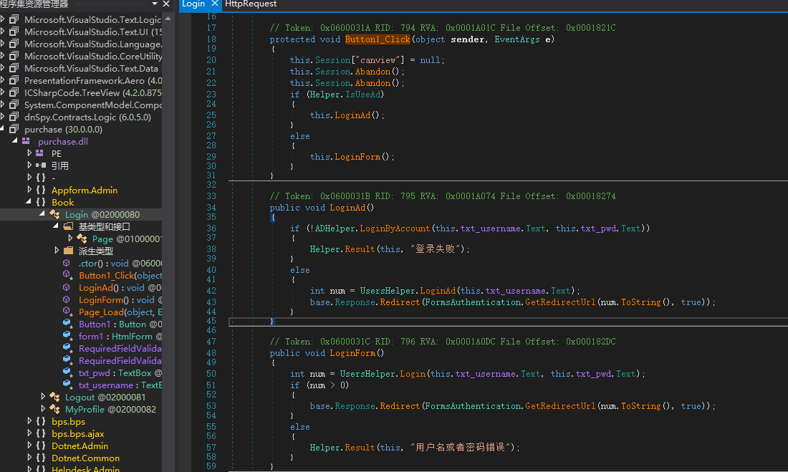
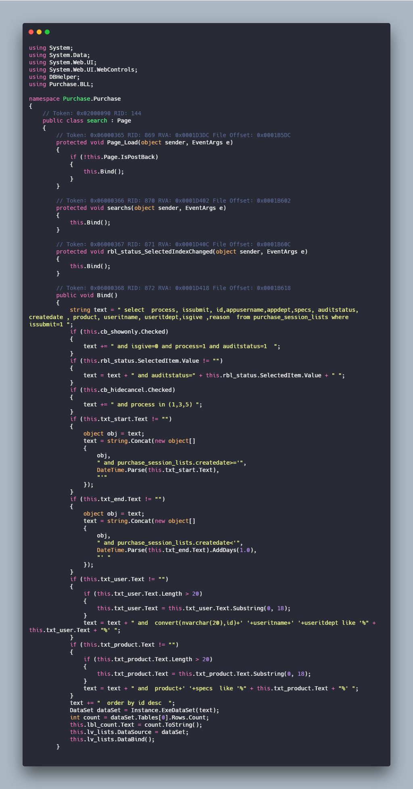
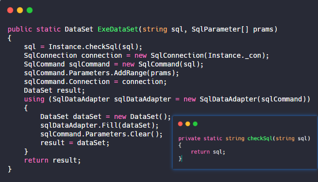
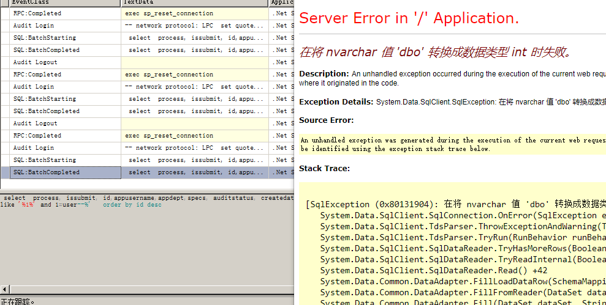
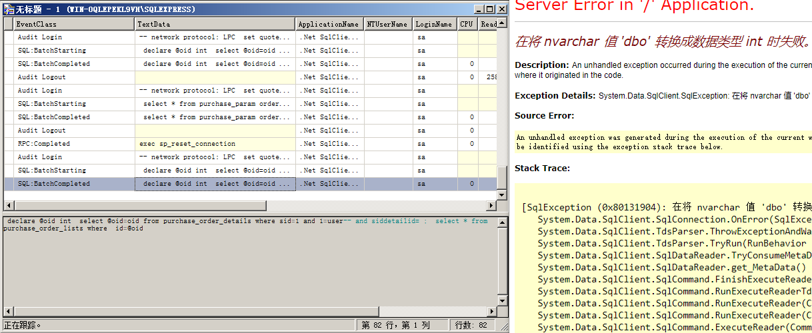

# 0x00 简介

基础知识：

ASP.NET开发可以选用两种框架：`ASP.NET Core`与`ASP.NET Framework`

ASP.NET开发也分为两种：

>WebApplication：

	WEB应用程序，改变代码后需要重启网页。具有namespace空间名称，项目中所有的程序代码文件，和独立的文件都被编译成为一个程序集，保存在bin文件夹中。

>WebSite：

	WEB网站，改变代码后不用重启网页。它没用到namespace空间名称，每个asp页面会转成一个dll。


ASP.NET比较关键的文件：

>web.config:

	1.web.config是基于XML的文件，可以保存到Web应用程序中的任何目录中，用来储存数据库连接字符、身份安全验证等。

	2.加载方式：当前目录搜索 -> 上一级到根目录 -> %windir%/Microsoft.NET/Framework/v2.0.50727/CONFIG/web.config -> %windir%/Microsoft.NET/Framework/v2.0.50727/CONFIG/machine.config -> 都不存在返回null

>Global.asax：

	1. Global.asax提供全局可用的代码，从HttpApplication基类派生的类，响应的是应用程序级别会话级别事件，通常ASP.NET的全局过滤代码就是在这里面。

ASP.NET的常见拓展名：

在`%windir%\Microsoft.NET\Framework\v2.0.50727\CONFIG\web.config`中有详细定义，这里提取部分简单介绍。

	```
	aspx：应用程序根目录或子目录，包含web控件与其他
	cs：类文件
	aspx.cs：web窗体后台程序代码文件
	ascx：应用程序根目录或子目录,Web 用户控件文件。
	asmx：应用程序根目录或子目录，该文件包含通过 SOAP 方式可用于其他 Web 应用程序的类和方法。
	asax：应用程序根目录，通常是Global.asax
	config：应用程序根目录或子目录，通常是web.config
	ashx：应用程序根目录或子目录,该文件包含实现 IHttpHandler 接口以处理所有传入请求的代码。
	soap:应用程序根目录或子目录。soap拓展文件

	```

# 0x01 环境配置

1.[windows 2008R2](https://msdn.itellyou.cn)

2.[SSMS数据库管理](https://docs.microsoft.com/zh-cn/sql/ssms/download-sql-server-management-studio-ssms?view=sql-server-ver15)

3.某系统

4.[dnSpy反编译](https://github.com/0xd4d/dnSpy)


# 0x02 熟悉框架

程序的文件目录

```
├─Admin
├─App_Data  //App_Data文件夹应该包含应用程序的本地数据存储
├─bin     // 包含应用程序所需的任何预生成的程序集
├─bootstrap
├─css
├─images
├─img
├─install
├─javascript
├─m
├─purchase
├─style
├─temp
├─Template
├─uploads
└─UserControl

```
WEB应用程序会把我们写的代码编译为DLL文件存放在Bin文件夹中，在ASPX文中基本就是一些控件名，所以需要反编译他的DLL来进行审计。

>Logout.aspx
```
<%@ Page Language="C#" AutoEventWireup="true" CodeBehind="Logout.aspx.cs" Inherits="Book.Logout" %>

<html xmlns="http://www.w3.org/1999/xhtml" >
.
.
.
</html>
```
在文件头中有这几个参数：

1.Language="C#"  //脚本语言

2.AutoEventWireup="true"  //是否自动关联某些特殊事件

3.CodeBehind="Logout.aspx.cs" //指定包含与页关联的类的已编译文件的名称

4.Inherits="Book.Logout" //定义供页继承的代码隐藏类

我们所关注的也就是`Inherits` 的值，如上所示他指向了`Bin`目录下的`purchase.dll`中`Book`类的`Logout`函数（注：purchase.dll是网站编译的项目名，一般与文件目录对应）

>web.config

这个文件包含了目录权限控制、数据库密码等等

```
  <location path="purchase/orderdetail.aspx">
    <system.web>
      <authorization>
        <allow users="*"/>
      </authorization>
    </system.web>
  </location>

  <authentication mode="Forms" />
```
比如我们使用的这套程序中[authorization](https://www.cnblogs.com/BlogShen/archive/2012/05/26/2519583.html)定义了`purchase/orderdetail.aspx`匿名可以访问，但是这套程序的本页面还写了一套验证

```
if (this.uid <= 0)
{
    if (!(base.Request.QueryString["g"] == "p"))
    {
        base.Response.Redirect("../login.aspx");
        return;
    }
    this.ph_pdf.Visible = false;
}
```
所以我们只需要访问`purchase/orderdetail.aspx?g=p`即可绕过跳转
，其中`<authentication mode="Forms" />`表示Form 表单认证。

在ASP.NET中全局过滤一般用到`Global.asax`至于他为什么可以起到全局过滤的作用可以看看[ASP.NET三剑客](https://blog.csdn.net/ZARA0830/article/details/80384263)。当然这套程序并没有全局过滤，在提交多个漏洞后，官网公告说这套程序建议内网部署，官网让公网部署的用户设置了身份验证:

```
<system.web> 
<authorization> 
<deny users= "?"/> 
</authorization> 
</system.web> 

```
但是这套程序安装会默认插入多条用户数据。

# 0x03 审计注入

首先我们来看`Login.aspx`，前面已经贴过代码，我们需要反编译`purchase.dll`去找`Book.Login`，这里使用`dyspy`



`login.aspx`->`Button1_Click`->`LoginForm()`在login中控件名对应dll

```
public void LoginForm()
{
    int num = UsersHelper.Login(this.txt_username.Text, this.txt_pwd.Text);
    if (num > 0)
    {
        base.Response.Redirect(FormsAuthentication.GetRedirectUrl(num.ToString(), true));
    }
    else
    {
        Helper.Result(this, "用户名或者密码错误");
    }
}

```
跟进`UsersHelper.Login`

```
public static int Login(string username, string password)
{
    string sql = " select uid  from users_users where username=@username and password=@password;   ";
    SqlParameter[] prams = new SqlParameter[]
    {
        new SqlParameter("@username", username),
        new SqlParameter("@password", Helper.Encrypt(password))
    };
    object obj = Instance.ExeScalar(sql, prams);
    if (obj == null || obj == DBNull.Value)
    {
        return -1;
    }
    int num = int.Parse(obj.ToString());
    if (num > 0)
    {
        UsersHelper.Login(num);
    }
    return num;
}

```
这里使用的是参数化查询，所以这里不存在注入。登陆后的注入很多这里选一个。

>search.aspx



这里剔除了部分无用代码，可以看到没有经过任何过滤，控件的值就拼接到`text`字符串,由`Instance.ExeDataSet(text)`执行，跟进`ExeDataSet`函数



没有过滤直接带入查询，如果你觉得从代码来看sql语句很麻烦，这里可以使用`Sql Sever Profiler`监控SQL语句。



>Payload:  `1%' and 1=user--`

前面说到`purchase/orderdetail.aspx?g=p`可以绕过直接访问，具体原因可以移步[《第二章：越权》](第二章：越权.md)，那么我们看看这个是否存在注入，如果存在那么将是一个前台注入。


看到`69-88`行，要执行命令需要`this.isview`为`true` ，在`30-36`行赋值只需要`t=view`即可
`sid`没有经过任何过滤，同时`ExeDataSet`函数也不存在过滤，即存在注入。

>Payload: `purchase/orderdetail.aspx?g=p&t=view&sid=1%20and%201=user--`



# 0x04 文末

在ASP.NET中注入比较常见，因为一般程序员都是使用的全局过滤，所以没有全局过滤的话，比较容易发现此类漏洞，也比较简单。