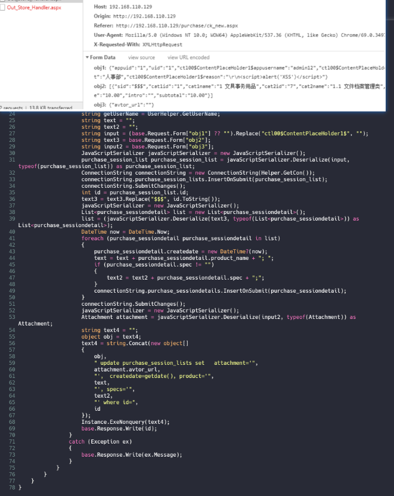
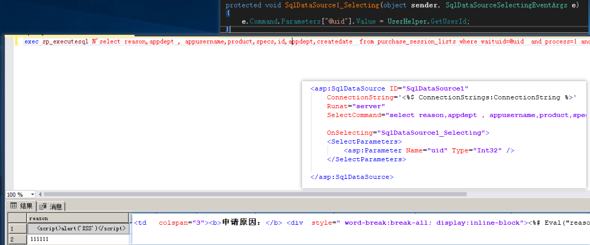
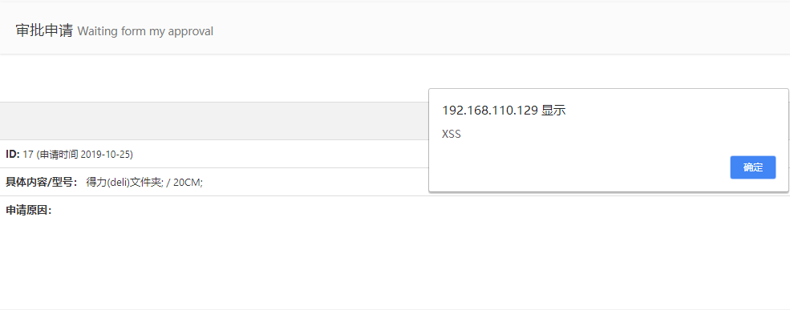
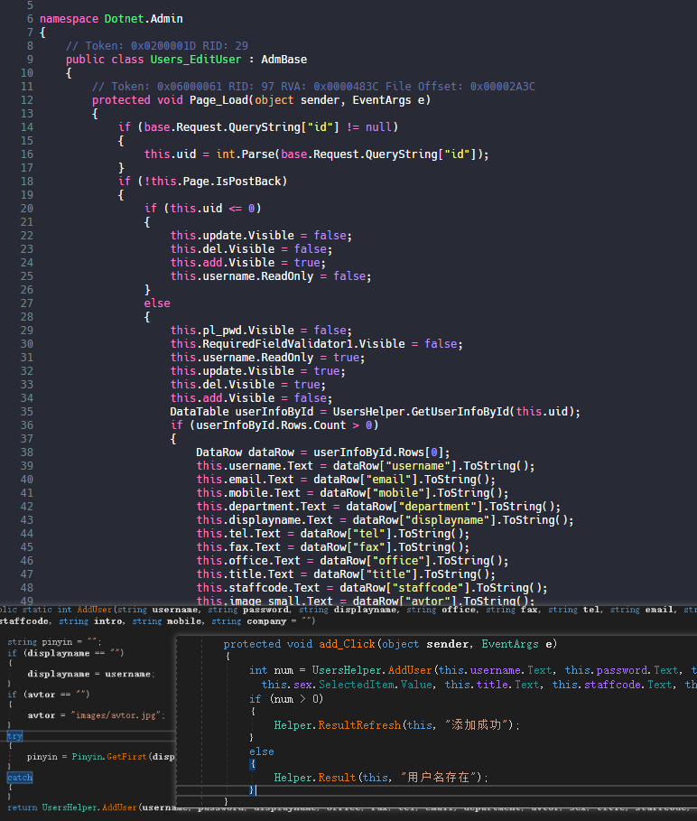
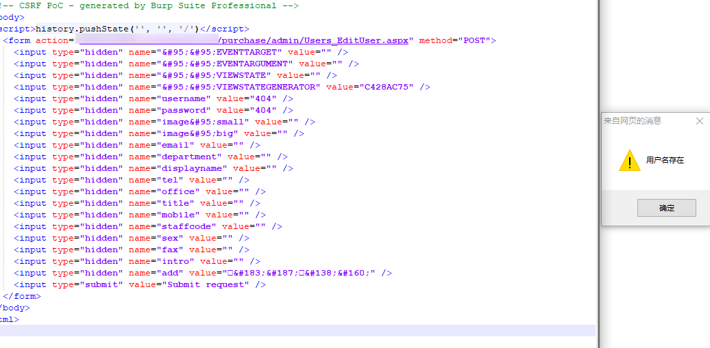

# 0x00 简介

本章内容：

1.xss

2.csrf

3.文件上传


# 0x01 XSS

在asp.net中我们插入XSS代码经常会遇到一个错误`A potentially dangerous Request.Form`


这是因为在`aspx`文件头一般会定义一句`<%@ Page validateRequest="true" %>` ，当然也可以在`web.config`中定义，值得注意的是`validateRequest`的值默认为`true` ,所以通常情况下asp.net基本上是不存在`XSS`的,除非程序员把他的值改变，如同这套源码的`web.config`。

```
<pages validateRequest="false" controlRenderingCompatibilityVersion="3.5" enableEventValidation="false">
    <controls>
    <add tagPrefix="pg" namespace="SiteUtils" assembly="DNHelper" />
    <add tagPrefix="pop" namespace="EeekSoft.Web" assembly="EeekSoft.Web.PopupWin" />
    <add tagPrefix="dnc" namespace="Dotnetcms.Controls" assembly="DNHelper" />
    <add tagPrefix="DayPilot" namespace="DayPilot.Web.Ui" assembly="DotnetControl" />
    </controls>
</pages>

```
简单的分析

>CK_New.aspx

`$.post("ajax/Out_Store_Handler.aspx"` 确认提交，通过`ajax`传送到`Out_Store_Handler.aspx`。

>Out_Store_Handler.aspx



整个过程是把传入过来的数据进行替换、插入数据库并没有经行任何过滤。

来到输入页面`Purchase_AuditingList.aspx`



从上往下看 查询->输出也没有过滤，所以造成了`XSS`。




# 0x01 CSRF



点击`add_Click`获取表单值后直接，传入`UsersHelper.AddUser` 函数最后由`UsersHelper.AddUser`函数插入数据库，整个过程没有验证CSRF。



# 0x02 文件上传

这套程序是最新版本所以任意文件不存在，只做粗略分析

>_uploadpic.ashx

```
private void SaveFile()
{
    string text = "../uploads/" + DateTime.Now.ToString("yyyy-MM") + "/";
    string text2 = HttpContext.Current.Server.MapPath(text);
    if (!Directory.Exists(text2))
    {
        Directory.CreateDirectory(text2);
    }
    HttpFileCollection files = HttpContext.Current.Request.Files;
    string fileName = Path.GetFileName(files[0].FileName);
    string extension = Path.GetExtension(files[0].FileName);
    string text3 = Helper.ReadConfigValue(Helper.ReadConfigXml("~/app_data/allow_ext.xml"), "allow_ext").ToString().ToLower();
    if (text3.Contains(extension.ToLower()))
    {
        string str = Guid.NewGuid().ToString() + extension;
        string filename = text2 + str;
        files[0].SaveAs(filename);
        string s = string.Concat(new string[]
        {
            "{\"jsonrpc\" : \"2.0\", \"result\" :\"",
            HttpContext.Current.Server.HtmlEncode(fileName),
            "\", \"id\" : \"",
            HttpContext.Current.Server.HtmlEncode(text + str),
            "\"}"
        });
        HttpContext.Current.Response.Write(s);
    }
}

```
文件名由`uploads` + `DateTime.Now.ToString("yyyy-MM")` + `Guid.NewGuid().ToString()` + `extension` (../uploads/2019-10/30777b5a-bd82-48eb-9104-24afffd97243.png) 所以能控制的只有`extension`，他由`Path.GetExtension` 直接获取文件后缀，但是`ReadConfigXml`读取`~/app_data/allow_ext.xml`的文件做比较，比较典型的白名单所以这里不存在任意文件上传。

>allow_ext.xml

```
<?xml version="1.0" standalone="yes"?>
<PItems>
  <PItem Name="allow_ext" Value=".rar.zip.jpg.png.gif.doc.docx.xls.xlsx.ppt.pptx.jpeg.pdf" />
</PItems>

```

# 0x03 文末

其他以后遇到慢慢补充