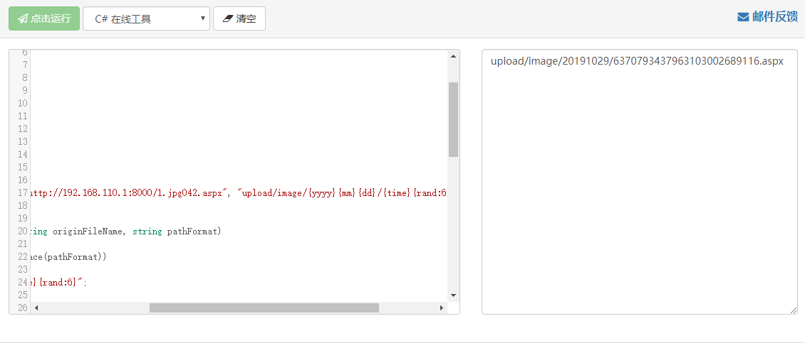

# 0x00 简介

[UEditor](https://github.com/fex-team/ueditor/releases) 的.NET版本N年前爆出一个远程下载漏洞。


# 0x01 漏洞成因

URL:

```
http://192.168.110.129:520/gbk-net/net/controller.ashx?action=catchimage

```
在POC中请求的URL如上，直接定位到文件`controller.ashx`。

>utf8-net\net\controller.ashx

```

case "listfile":
    action = new ListFileManager(context, Config.GetString("fileManagerListPath"), Config.GetStringList("fileManagerAllowFiles"));
    break;
case "catchimage":
    action = new CrawlerHandler(context);
    break;

```
`catchimage` 调用`CrawlerHandler` 进而跟进`CrawlerHandler`


>utf8-net\net\App_Code\CrawlerHandler.cs


```

public class CrawlerHandler : Handler
{
    private string[] Sources;
    private Crawler[] Crawlers;
    public CrawlerHandler(HttpContext context) : base(context) { }

    public override void Process()
    {
        Sources = Request.Form.GetValues("source[]");
        if (Sources == null || Sources.Length == 0)
        {
            WriteJson(new
            {
                state = "参数错误：没有指定抓取源"
            });
            return;
        }
        Crawlers = Sources.Select(x => new Crawler(x, Server).Fetch()).ToArray();
        WriteJson(new
        {
            state = "SUCCESS",
            list = Crawlers.Select(x => new
            {
                state = x.State,
                source = x.SourceUrl,
                url = x.ServerUrl
            })
        });
    }
}

```

`CrawlerHandler`获取`Sources`判断是否为空，这里只需要构造`Sources[]=url`即可，然后后调用`Crawler Fetch`。


>Crawler Fetch()

```

public Crawler Fetch()
{
    if (!IsExternalIPAddress(this.SourceUrl))
    {
        State = "INVALID_URL";
        return this;
    }
    var request = HttpWebRequest.Create(this.SourceUrl) as HttpWebRequest;
    using (var response = request.GetResponse() as HttpWebResponse)
    {
        if (response.StatusCode != HttpStatusCode.OK)
        {
            State = "Url returns " + response.StatusCode + ", " + response.StatusDescription;
            return this;
        }
        if (response.ContentType.IndexOf("image") == -1)
        {
            State = "Url is not an image";
            return this;
        }
        ServerUrl = PathFormatter.Format(Path.GetFileName(this.SourceUrl), Config.GetString("catcherPathFormat"));
        var savePath = Server.MapPath(ServerUrl);
        if (!Directory.Exists(Path.GetDirectoryName(savePath)))
        {
            Directory.CreateDirectory(Path.GetDirectoryName(savePath));
        }
        try
        {
            var stream = response.GetResponseStream();
            var reader = new BinaryReader(stream);
            byte[] bytes;
            using (var ms = new MemoryStream())
            {
                byte[] buffer = new byte[4096];
                int count;
                while ((count = reader.Read(buffer, 0, buffer.Length)) != 0)
                {
                    ms.Write(buffer, 0, count);
                }
                bytes = ms.ToArray();
            }
            File.WriteAllBytes(savePath, bytes);
            State = "SUCCESS";
        }
        catch (Exception e)
        {
            State = "抓取错误：" + e.Message;
        }
        return this;
    }
}

```

这里首先调用函数`IsExternalIPAddress` 判断你是不是一个正常的域名，不是则`return`。
然后请求传入的`URL`查看是否响应200，再判断`ContentType`是否为`image`，在这里其实只要构建服务器返回的`Content-Type`为`image/xxxx`即可，重点在`PathFormatter`我们跟进。


>utf8-net\net\App_Code\PathFormater.cs

```

public static string Format(string originFileName, string pathFormat)
{
    if (String.IsNullOrWhiteSpace(pathFormat))
    {
        pathFormat = "{filename}{rand:6}";
    }

    var invalidPattern = new Regex(@"[\\\/\:\*\?\042\<\>\|]");
    originFileName = invalidPattern.Replace(originFileName, "");  //替换正则匹配到的为空1.png.aspx

    string extension = Path.GetExtension(originFileName); //.aspx
    string filename = Path.GetFileNameWithoutExtension(originFileName);

    pathFormat = pathFormat.Replace("{filename}", filename);
    pathFormat = new Regex(@"\{rand(\:?)(\d+)\}", RegexOptions.Compiled).Replace(pathFormat, new MatchEvaluator(delegate(Match match)
    {
        var digit = 6;
        if (match.Groups.Count > 2)
        {
            digit = Convert.ToInt32(match.Groups[2].Value);
        }
        var rand = new Random();
        return rand.Next((int)Math.Pow(10, digit), (int)Math.Pow(10, digit + 1)).ToString();
    }));

    pathFormat = pathFormat.Replace("{time}", DateTime.Now.Ticks.ToString());
    pathFormat = pathFormat.Replace("{yyyy}", DateTime.Now.Year.ToString());
    pathFormat = pathFormat.Replace("{yy}", (DateTime.Now.Year % 100).ToString("D2"));
    pathFormat = pathFormat.Replace("{mm}", DateTime.Now.Month.ToString("D2"));
    pathFormat = pathFormat.Replace("{dd}", DateTime.Now.Day.ToString("D2"));
    pathFormat = pathFormat.Replace("{hh}", DateTime.Now.Hour.ToString("D2"));
    pathFormat = pathFormat.Replace("{ii}", DateTime.Now.Minute.ToString("D2"));
    pathFormat = pathFormat.Replace("{ss}", DateTime.Now.Second.ToString("D2"));

    return pathFormat + extension;
}

```
整个逻辑流程就是 `originFileName: 1.png?.aspx -> 1.png.aspx - > .aspx`

`pathFormat: 获取config.json的格式` 然后拼接返回保存文件的路径，可以把代码单独扣出来运行。



其实我们直接控制`Content-Type`为`image/xxxx` 后缀名为我们想要的即可，比如

`http://192.168.110.1:8000/1.ashx`


# 0x02 总结

有的网上的poc只是为了方便大多数环境，当我们细读源码后知道新的方法往往能找到一些WAF绕过的技巧。